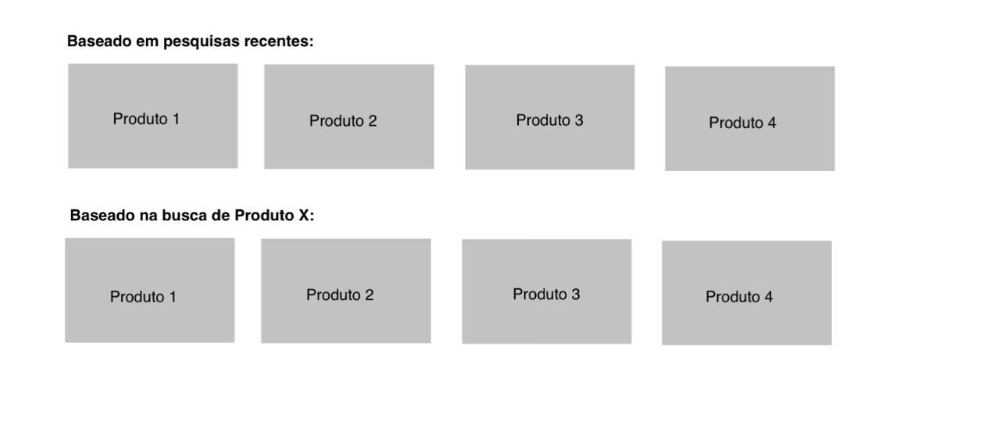
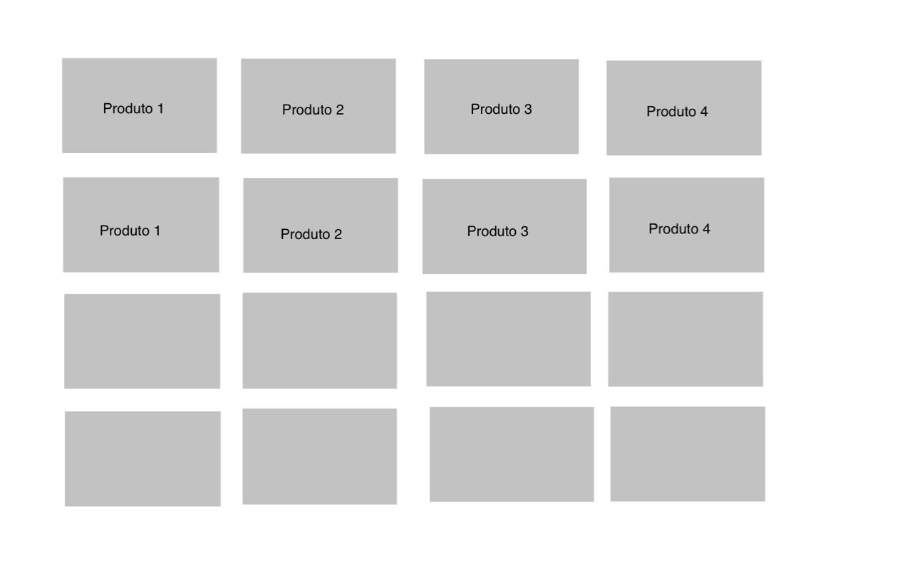

# Ecommerce 1/2

    <strong> 
A proposta do Projeto descreve que as informações de Produto, Usuario e Venda precisam ser armazenadas em Banco de Dados Relacional, e as atividades de recomandação, Como o clique de produtos com a finalidade de gerar recomandações em Banco de Dados Não Relacional, por tanto, os EndPoints estão separados em 2 arquivos README: 
    </strong>

#### - DADOS DE [VENDAS E USUARIOS](README_SQL.md)
> #### - DADOS DE PRODUTO E SALVAR USUÁRIO *NO MONGO ABAIXO*!
---

### Backend - NoSQL

### PRODUTOS

#### GET-> http:localhost:3000/produtos/predicaoByClique/{idUser}
#### Entrada:
    {
      "idUsuario":"01"
    }
#### Saida:
    {
      "Recente": "B0C7W863T2",
      "Pesquisou": "B07DKWJZBK"
    }
#### Esse EndPoint retorna 2 atributos:
#### - Recente: Product_id de um clique armazenado, escolhido aleatoriamente entre os cliques dos ultimos 2 dias.
#### - Pesquisou: Product_id de um clique armazenado, escolhido aleatoriamente entre os cliques com  data superior a 2 dias.
#### Usar esses dois Product_id para receber as privisões do EndPoint /produtos/predicao/{product_id}, e exibi-los para o usuário no GRID:

#### GET-> http:localhost:3000/produtos
#### Entrada:

#### Nenhuma

#### Saida:
     {
       "_id":"68cbf456fa59182dd2aa6572",
       "product_id":"B088C4QZV2","product_name":"Lâmpada Inteligente Smart Color 10W Elgin RGB Wifi Compatível com Alexa e Google Home",
       "img_link":"https://m.media-amazon.com/images/I/61dLgPIgKML._AC_UL320_.jpg",
       "rating":4.6,
       "rating_count":42444,
       "actual_price":49.93,
       "listPrice":99,
       "category":"TV, Áudio e Cinema em Casa",
       "descrição":"Lâmpada Inteligente Smart Color Elgin Wifi Compatível com Alexa e Google Home: facilita sua rotina com uso intuitivo e manutenção simples. Design prático, fácil de transportar, ideal para casa, trabalho e viagens."
     }
#### Esse EndPoint retorna um Array com todos os produtos do Ecommerce e seus atributos.
#### Usar esse esse array para criar o componente GRID de produtos, com pesquisa/seleção de categoria:

#### GET-> http:localhost:3000/produtos/predicao/{id}
#### Entrada:
    {
      "id":"B088C4QZV2"
    }
#### Saida:

    {
      "ok": true, 
      "data": 
      {
          \"product_id\": \"B0BDZXLS77\", 
          \"product_name\": \"lmpada inteligente 15w smart color rgb wifi elgin compatvel alexa google home\", 
          \"rating\": 4.6, 
          \"img_link\": \"https://m.media-amazon.com/images/I/51NspUbV0BL._AC_UL320_.jpg\"
      }
    }
#### Esse EndPoint retorna um Array com 10 produtos iguais, gerados a partir das predições.
#### Usar para gerar os grids de precvisão, conforme mostrado lá encima!

#### POST-> http:localhost:3000/usuarios/setClique
#### Entrada:
    {
      "usuario":"01",
      "clique":[{
          "product_id":"B07ZJTX8X1",
          "product_name":"Kalciferum: Demônios, Bruxas e Vagantes",
          "data":"2025-09-28"
          }]
    }
#### Saida:
    {
      "Mensagem": "Sucesso!"
    }
#### Usar esse EndPoint para armazenar a atividade no BD.
#### Utilizar no click do botão de seleção do produto, passando o product_id, o nome e data do clique.

### USUÁRIO

#### POST-> http:localhost:3000/usuarios
#### Entrada:
    {
      "id":"01",
      "cliquesProduto: []
    }
#### Saida:
    {
      "Mensagem": "Sucesso!"
    }
#### Como o Mongo só está sendo usado para captar a atividade, ou seja, os cliques, sendo produtos, compra e usuarios registrados no SQL, essa função
#### será utilizada apenas, para "trazer" o ID do usuário no SQL para o Mongo, afim de criar um chaveamento unico geral. Isso deve ocorrer no momento 
#### de cadastramento do usuário, para evitar erros e bugs.

teste local fastapi: python -m uvicorn app:app --port 8000 --reload --env-file .env
